# Cyan Rice Dotfiles

This repository contains personal config files (dotfiles) for Arch Linux, featuring high customize Hyprland setup with a consistent **Cyan Color** aesthetic.

## Screenshots

<details>
<summary>Interface & Layout</summary>
<br>
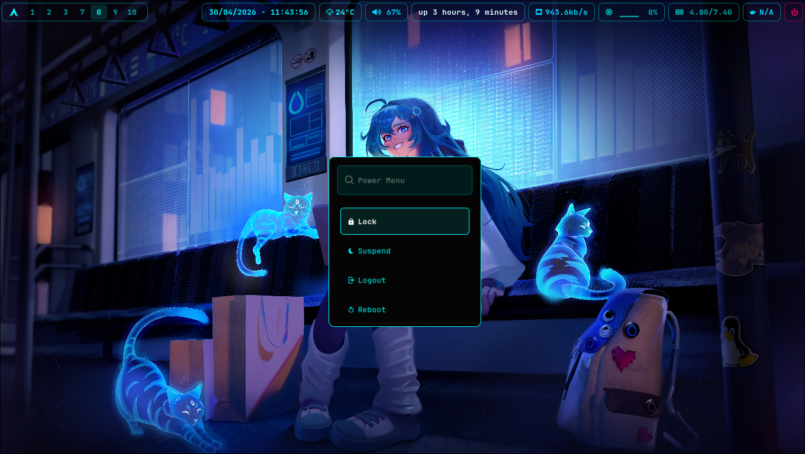
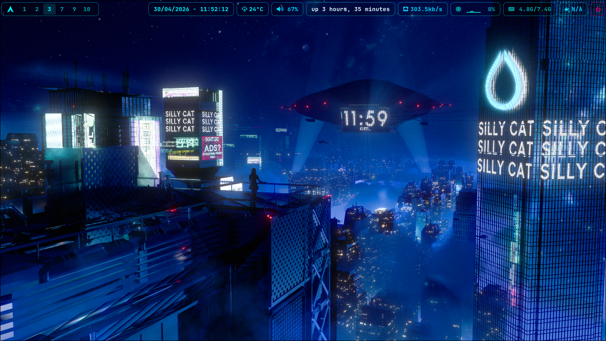
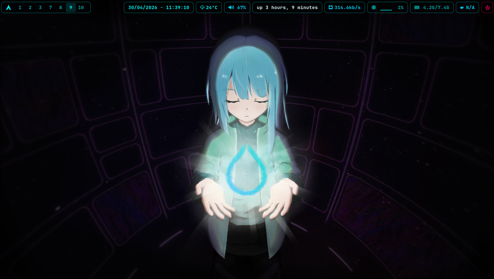
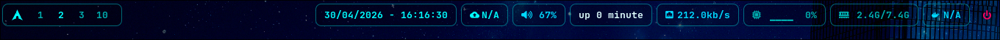
</details>

<details>
<summary>Apps Launcher & Menus (Wofi)</summary>
<br>
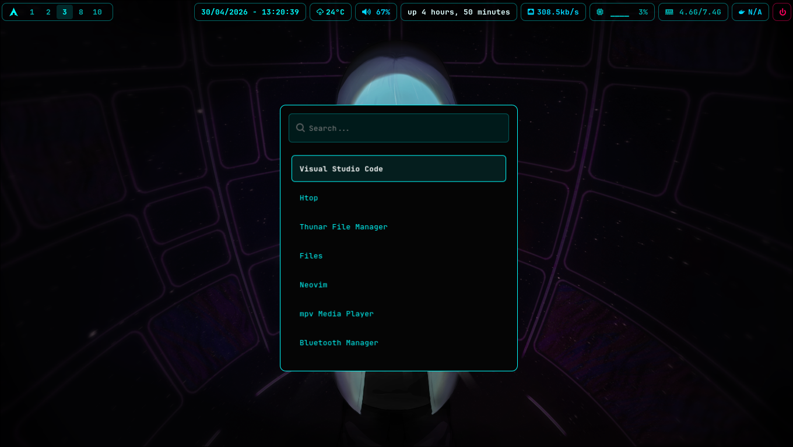
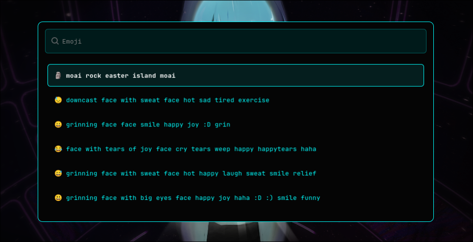
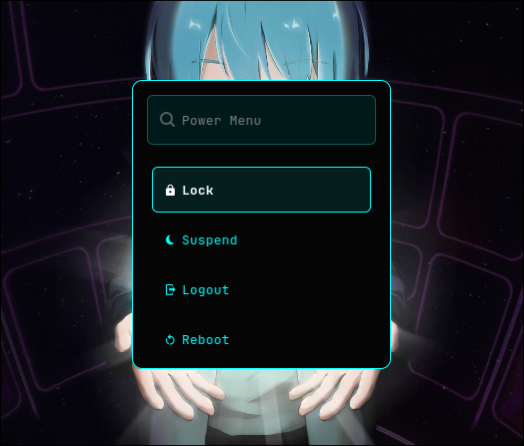
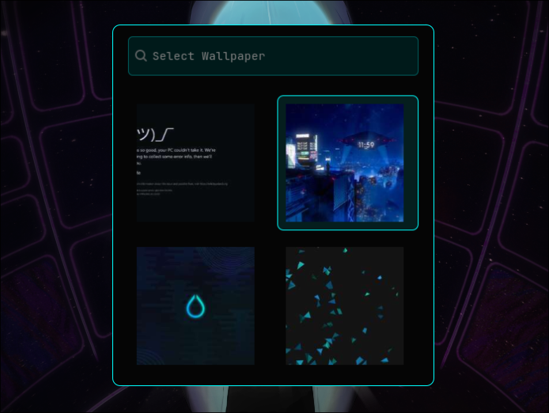
</details>

<details>
<summary>TUI & CLI Tools</summary>
<br>
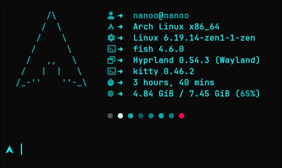
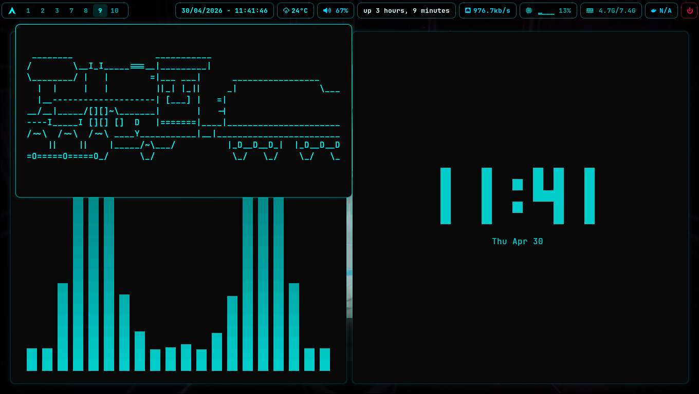
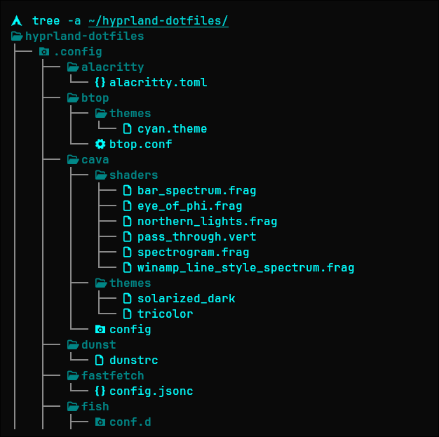
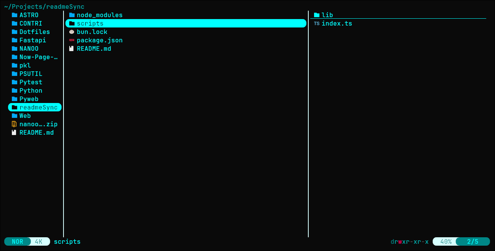
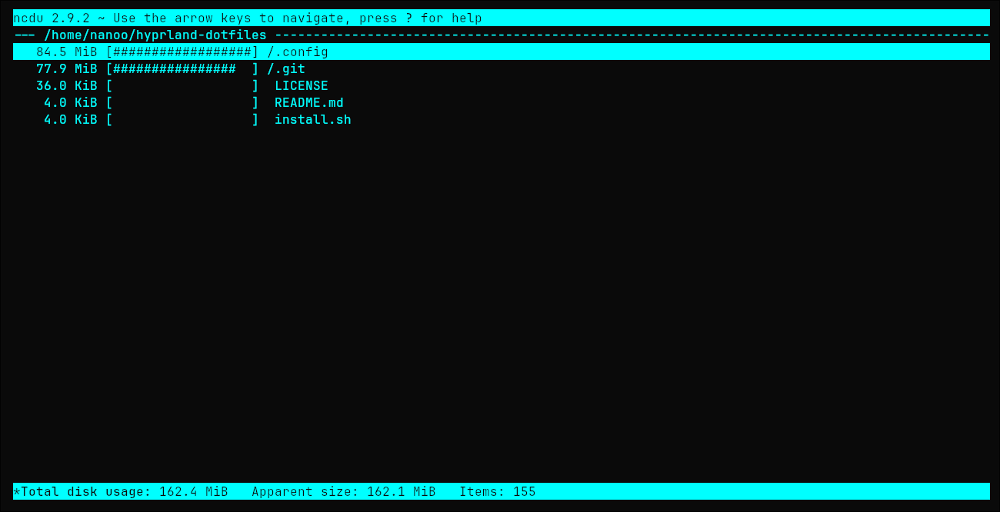
</details>

## Project Overview

- **Window Manager:** [Hyprland](https://hyprland.org/) (Wayland Compositor)
- **Shell:** [Fish Shell](https://fishshell.com/) with [Starship](https://starship.rs/) prompt
- **Editor:** [Neovim](https://neovim.io/) (using the [LazyVim](https://www.lazyvim.org/) distribution)
- **Status Bar:** [Waybar](https://github.com/Alexays/Waybar)
- **Terminal:** [Kitty](https://sw.kovidgoyal.net/kitty/)
- **Theme:** Custom Cyan-themed UI components (`#00ffff`), including borders, prompt, and terminal colors.
- **License:** [GPL-3.0](LICENSE)

## Directory Structure

```text
.config/
├── alacritty/
├── btop/
├── cava/
├── dunst/
├── fastfetch/
├── fish/
├── htop/
├── hypr/
│   ├── conf/
│   ├── hyprland.conf
│   ├── hyprlock.conf
│   └── hyprpaper.conf
├── kitty/
├── lazygit/
├── lsd/
├── nvim/
├── theme/
├── wallpapers/
├── waybar/
├── wofi/
└── yazi/
```

## Key Program

As defined in `hypr/conf/programs.conf`:

- **Terminal:** Kitty
- **File Manager:** Dolphin / Thunar
- **Menu/Launcher:** Wofi (Cyan-cyber theme)
- **Browser:** Firefox
- **Editor:** Neovim / VS Code
- **Lock Screen:** Hyprlock
- **Logout/Power Menu:** Wofi Power Menu

## Keybinding

The following shortcuts are defined in `hypr/conf/keybindings.conf`:

### Apps & Menus

- `Super + Return` / `Q`: Open Terminal
- `Super + B`: Open Browser
- `Super + E`: Open File Manager
- `Super + D`: Open Wofi Launcher
- `Super + .`: Emoji Selector (Wofi)
- `Super + M`: Power Menu (Wofi)
- `Super + G`: Volume Control (Pavucontrol)
- `Super + Shift + W`: Wallpaper Select (Wofi)
- `Super + Shift + S`: Screenshot (Grim/Slurp)
- `Super + Shift + V`: Open Neovim

### Window Management

- `Super + Shift + Q`: Close active window
- `Super + V`: Toggle floating
- `Super + P`: Pseudo Tiling
- `Super + J`: Toggle Split
- `Super + Arrow Keys`: Move focus

### Workspaces

- `Super + 1-10`: Switch workspaces
- `Super + Shift + 1-10`: Move window to workspace
- `Super + Scroll`: Switch workspaces

### System (Media Keys)

- `Vol Up/Down/Mute`: Audio Control
- `Brightness Up/Down`: Screen Brightness
- `Media Play/Pause/Next/Prev`: Player Control

## Usage

These configurations are designed to be located in `~/.config/`.

- To apply changes to Hyprland, reload the compositor (usually automatic on save or via `hyprctl reload`).
- To reload Waybar, use the script at `waybar/reload.sh`.

## Credits

This setup is built upon the incredible work of the open-source community. special thanks to:

- **[elifouts (Dotfiles)](https://github.com/elifouts/Dotfiles):** For the beautiful Wofi configurations, Powermenu, and Hyprlock setup.
- **[dln (wofi-emoji)](https://github.com/dln/wofi-emoji):** For the emoji selector script logic used in `emoji.sh`.
- **[Aditya Shakya (adi1090x)](https://github.com/adi1090x/rofi):** For the inspiration behind the Rofi/Wofi themes.
- **[Muhammad Diaz (MDiaznf23)](https://github.com/MDiaznf23):** For the some config on `simple-autoricing-i3wm-dotfiles`.
- **[LazyVim](https://www.lazyvim.org/):** For the modern and powerful Neovim config framework.
- **[Shivam Salkar (minimal-waybar-config)](https://github.com/shivam-salkar/minimal-waybar-config):** For the sleek and minimal Waybar configuration that serves as the base for the status bar.
- **[Mahaveer Gurjar (Hyprlock-Dots)](https://github.com/mahaveergurjar/Hyprlock-Dots):** For the collection of Hyprlock layouts and scripts.
- **[Hyprland Community](https://hyprland.org/):** For the amazing Wayland compositor.
- **Arch Linux:** For being the foundation of this ricing journey.
